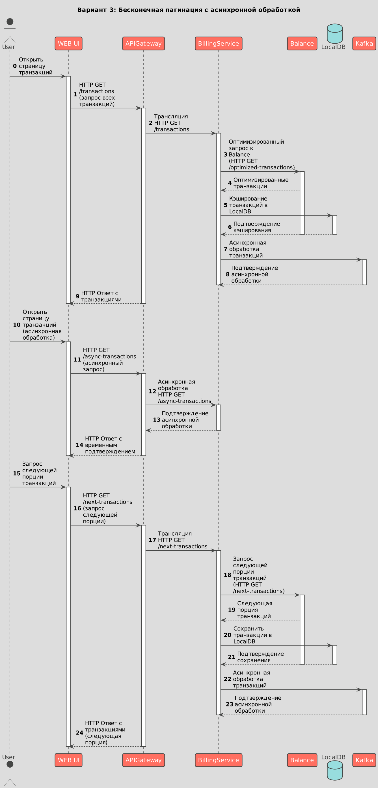

# Управление транзакциями в системе Billing

## Функциональные требования

[Интерфейс взаимодействия с транзакциями](https://example.com/issue/5678)

## Проблема
В настоящее время отсутствует эффективный механизм сохранения транзакций в локальной базе данных BillingService при взаимодействии с сервисом Balance. Требуется определить оптимальный метод сохранения транзакций, учитывая различные сценарии обращения к сервису Balance.

## Решение
Предложены три варианта для сохранения транзакций в локальной базе данных BillingService:

### Вариант 1
1. Сервис Balance возвращает 1000+ последних транзакций.

#### Архитектура
* [Диаграмма последовательности (Sequence diagram)](#диаграмма-последовательности-вариант-1)
* [C4-модель: Уровень C1 (Системы)](#c4-модель-уровень-c1-системы-вариант-1)
* [C4-модель: Уровень C2 (Контейнеры)](#c4-модель-уровень-c2-контейнеры-вариант-1)

#### Диаграмма последовательности (Sequence diagram)

#### C4-модель: Уровень C1 (Системы)

#### C4-модель: Уровень C2 (Контейнеры)

### Вариант 2
2. Сервис Balance возвращает 100 (лимит) последних транзакций.

#### Архитектура
* [Диаграмма последовательности (Sequence diagram)](#диаграмма-последовательности-вариант-2)
* [C4-модель: Уровень C1 (Системы)](#c4-модель-уровень-c1-системы-вариант-2)
* [C4-модель: Уровень C2 (Контейнеры)](#c4-модель-уровень-c2-контейнеры-вариант-2)

#### Диаграмма последовательности (Sequence diagram)

#### C4-модель: Уровень C1 (Системы)

#### C4-модель: Уровень C2 (Контейнеры)

### Вариант 3
3. Бесконечная пагинация.

#### Архитектура
* [Диаграмма последовательности (Sequence diagram)](#диаграмма-последовательности-вариант-3)
* [C4-модель: Уровень C1 (Системы)](#c4-модель-уровень-c1-системы-вариант-3)
* [C4-модель: Уровень C2 (Контейнеры)](#c4-модель-уровень-c2-контейнеры-вариант-3)

#### Диаграмма последовательности (Sequence diagram)

#### C4-модель: Уровень C1 (Системы)

#### C4-модель: Уровень C2 (Контейнеры)

